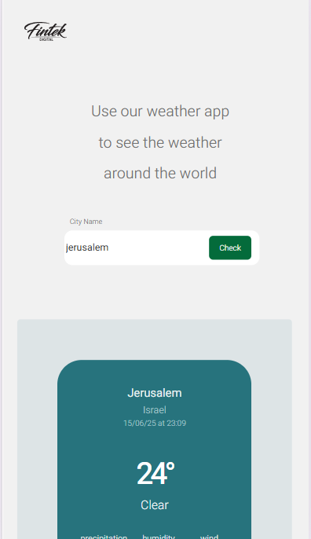

# 🌤️ Weather App - Full Stack Project

A complete weather application built with React frontend and Node.js backend, delivering real-time weather information with a modern, responsive design.

## 🏗️ Project Architecture

```
weather-app/
├── 📱 client/          # React Frontend Application
├── 🚀 server/          # Node.js Backend API
└── 📋 README.md        # This overview
```

## ✨ Key Features

- **🔍 Smart Search** - Fast city search with validation
- **🌡️ Real-time Data** - Current weather + 5-hour forecast  
- **📱 Fully Responsive** - Works perfectly on all devices
- **🎨 Modern Design** - Clean Hebrew interface with Heebo font
- **⚡ Fast Performance** - Optimized client-server communication

## 🛠️ Tech Stack

| Frontend | Backend |
|----------|---------|
| React | Node.js + Express |
| Axios | WeatherAPI Integration |
| CSS3 | Advanced Input Validation |
| Responsive Design | Smart Time Logic |

## 🚀 Quick Start

### 1. Clone Repository
```bash
git clone [repository-url]
cd weather-app
```

### 2. Start Backend
```bash
cd server
npm install
# Add your WeatherAPI key to .env
npm start  # Runs on :8080
```

### 3. Start Frontend
```bash
cd client
npm install
npm run dev  # Runs on :5173
```

## 📸 Screenshots

### Desktop View

*Two-column responsive layout with search panel and weather display*

### Mobile View


*Fully responsive mobile interface optimized for touch interaction*

### App Demo

*Live demonstration of city search and weather data display*

## 📋 Detailed Documentation

- **[Client Documentation](./client/README.md)** - React app setup, components, styling
- **[Server Documentation](./server/README.md)** - API endpoints, configuration, deployment

## 🎯 Project Highlights

### Frontend Excellence
- Modern React architecture with reusable components
- Pixel-perfect responsive design (Desktop/Tablet/Mobile)
- Professional Hebrew typography and color scheme
- Smooth animations and user feedback

### Backend Sophistication  
- Intelligent hourly forecast logic with edge case handling
- Robust input validation and error management
- Clean REST API design
- Production-ready server configuration

### Full-Stack Integration
- Seamless client-server communication
- Consistent error handling across layers
- Optimized data flow and state management

## 📱 Live Demo

*Search any city and get instant weather data with hourly forecasts*

## 🎓 Learning Outcomes

This project demonstrates:
- **Full-Stack Development** - Complete application architecture
- **Modern React** - Hooks, components, responsive design  
- **Backend APIs** - Express server, external API integration
- **Production Skills** - Error handling, validation, deployment
- **UX/UI Design** - Professional interface and user experience

---

💼 **Developed as part of practicum coursework - demonstrating production-ready full-stack development skills**