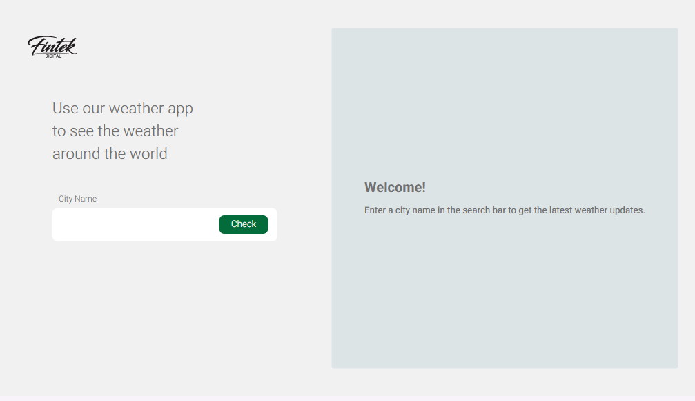
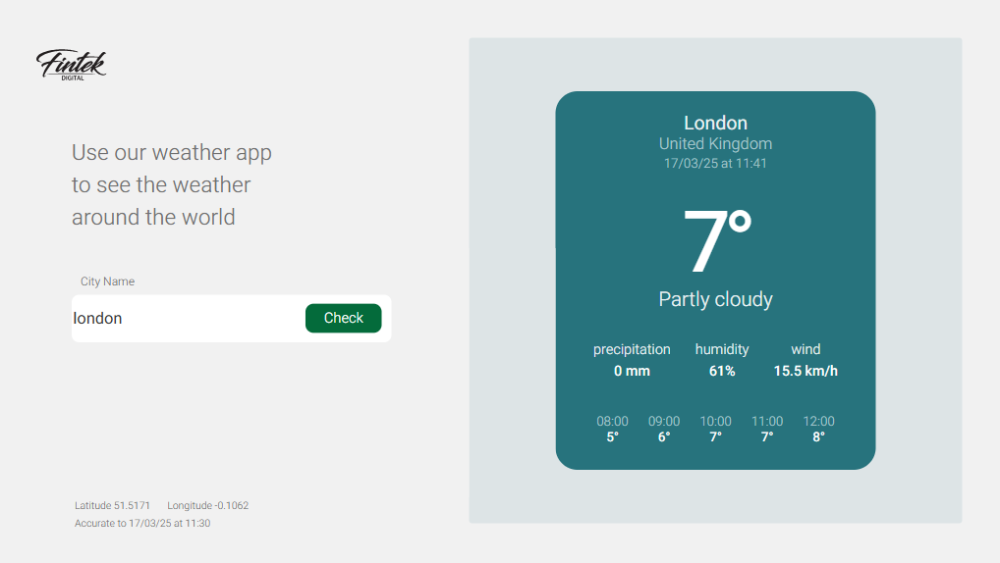
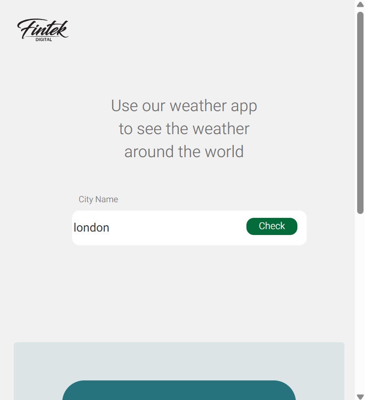
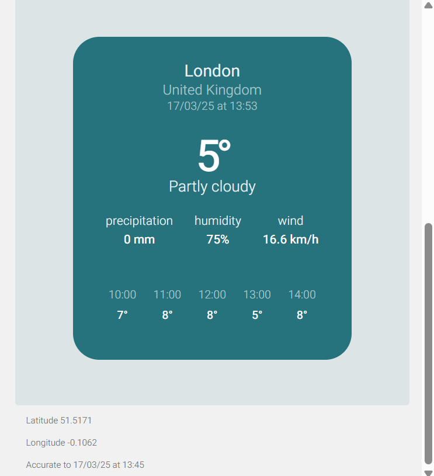

# Weather App ☂️⛅☀️  

## Project Description  
A real-time weather forecasting app based on the city name.  
The project is built using **React** on the client-side and **Node.js** on the server-side.  
The app displays the current weather, upcoming temperature predictions, and a comparison with previous hours.

## Technologies  
- **Frontend:** React, Vite  
- **Backend:** Node.js, Express  
- **State Management:** React Hooks  
- **API:** WeatherAPI  
- **Request Library:** Axios  
- **Environment Variables:** dotenv  
- **CORS:** Enables requests between the server and client-side  

## How to Use?  

### Client-side  
1. Enter the city name in the text box.  
2. After submission, the current weather temperature of the requested city will be displayed.  
3. The app also shows temperatures for the upcoming hour and compares them with previous weather conditions.  

### Server-side  
The server accepts `GET` requests at the following endpoint:   

```
/weather/:city
```

Where `city` is the name of the city.  

For example, a request for the city **Tel Aviv**:  

```
GET /weather/Tel Aviv
```

## How to Run the Project?  

### 1️⃣ Install Dependencies  
```sh
cd client  
npm install  

cd ../server  
npm install  
```

### 2️⃣ Set up API Keys  
The project requires an **API Key** to connect to WeatherAPI.  

- Sign up for an account on WeatherAPI.  
- Add your key to the `.env` file in the server folder:  

```sh
API_KEY=YOUR_API_KEY
```

### 3️⃣ Running the Project  
Open two terminals:  

**First Terminal (Server):**  
```sh
cd server  
node server.js  
```

**Second Terminal (Client):**  
```sh
cd client  
npm run dev  
```
## Screenshot









